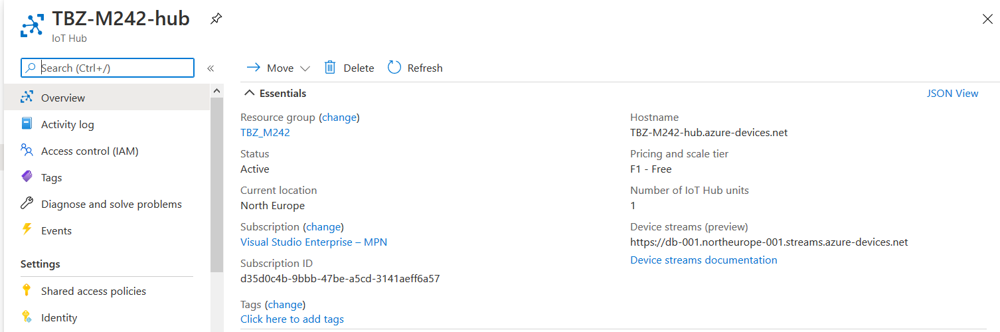
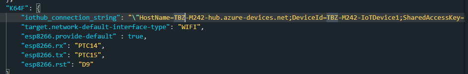
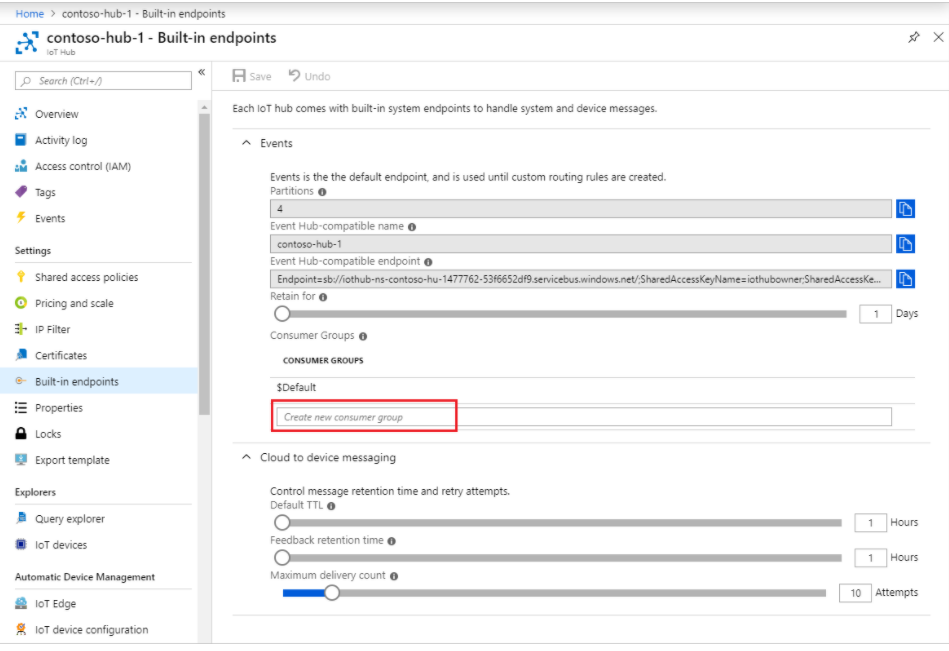
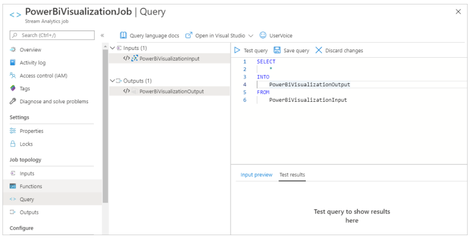
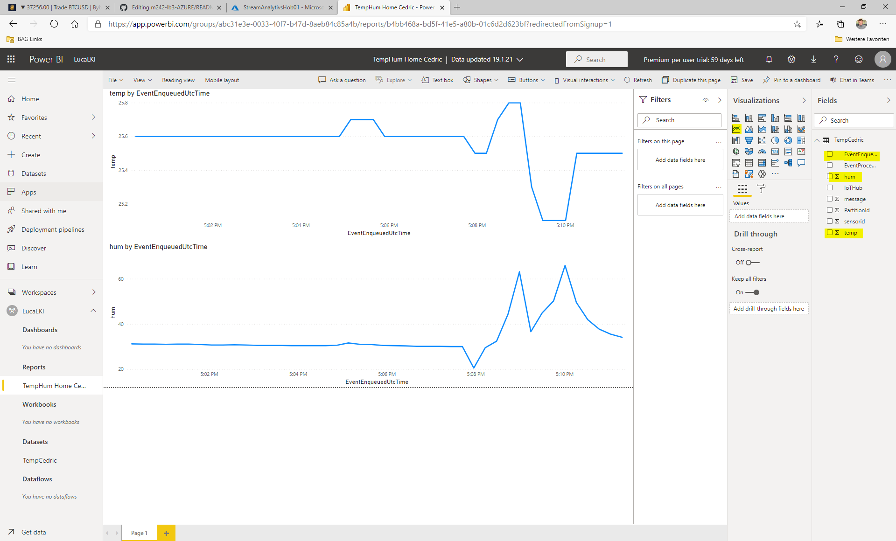
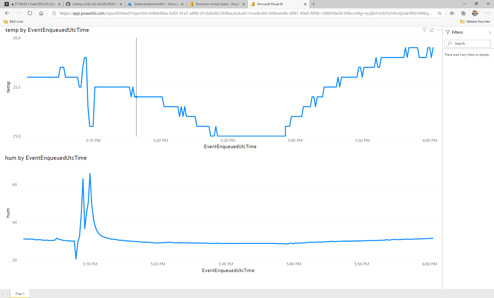
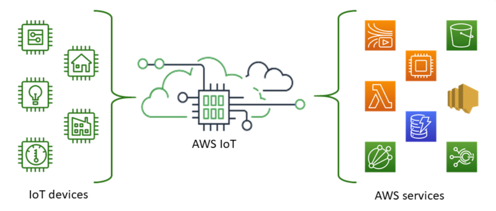

## Cloud IoT Services
***

> [⇧ **Home**](../README.md)

Cloud Anbindung an Amazon (AWS), Google und Microsoft (Azure)

## Azure IoT
***

Quelle: https://docs.microsoft.com/de-de/azure/iot-hub/about-iot-hub
- - - 

IoT Hub ist ein in der Cloud gehosteter, verwalteter Dienst, der als zentraler Nachrichtenhub für die bidirektionale Kommunikation zwischen Ihrer IoT-Anwendung und den Geräten dient, die von der Anwendung verwaltet werden. Sie können Azure IoT Hub verwenden, um IoT-Lösungen mit zuverlässiger und sicherer Kommunikation zwischen Millionen von IoT-Geräten und einem in der Cloud gehosteten Lösungs-Back-End zu erstellen. Sie können praktisch jedes Gerät mit IoT Hub verbinden.

IoT Hub unterstützt die Kommunikation sowohl vom Gerät an die Cloud als auch von der Cloud an das Gerät. IoT Hub unterstützt mehrere Messagingmuster wie z.B. Gerät-zu-Cloud-Telemetrie, Dateiuploads von Geräten und Anforderungs-Antwort-Methoden zum Steuern der Geräte über die Cloud. Die IoT Hub-Überwachung unterstützt Sie dabei, die Integrität Ihrer Lösung sicherzustellen, indem Ereignisse wie Geräteerstellung, Geräteausfälle und Geräteverbindungen nachverfolgt werden.

Azure IoT Hub unterstützt folgende Protokolle:
* HTTPS
* AMQP
* AMQP über WebSockets
* MQTT
* MQTT über WebSockets

### Beispiel(e)

* [Using MQTT to connect an IoT Hub with Micropython on ESP32](https://github.com/Azure-Samples/IoTMQTTSample/tree/master/src/MicroPython)

**Anzeigen der Meldungen**

Dazu muss zuerst das Azure CLI installiert werden.

Anschliessend sich einloggen, `azure-iot` Extension installieren und Events ausgeben

    az login
    az extension add --name azure-iot
    az iot hub monitor-events --hub-name <IoT Hub Name> --props all

**Links**
* [How to test Messages arriving in Azure IoTHub](https://stackoverflow.com/questions/35381303/how-to-test-messages-arriving-in-azure-iothub)

### Azure PowerBi Pipeline

- - - 

Azure stellt mit PowerBi einen Möglichkeit zur Verfügung die Sensordaten weiterzuverarbeiten.

Dazu sind einige Schritte nötig.

Zuerst ist ein IoT Hub in der Azure Cloud zu erstellen:

Und in diesem eine IoT Device

Damit sich das IoTKitV3 mit der Azure Cloud verbinden kann, brauchen wir den "Primary Connection String". Dieser ist in die Datei `mbed_app.json` zur übertragen.
Anschliessend ist das Programm zu compilieren und z.B. wie oben beschrieben, zu testen.

#### Auswerten der Daten 

Um die Daten in der Azure Cloud auszuwerten, braucht es einen Stream Analytics Job welcher die Daten sammelt und an PowerPi weiterreicht.

 

Consumer Gruppe zu IoT hub hinzufügen

  

Stream Analytics Job erstellen

  
 

Input und Output zum Stream Analytics Job hinzufügen und Verlinkung mit IoT Hub

  

Query anpassen, damit er mit dem Stream Analytics Jobs übereinstimmt. Starten des Jobs, welche die Daten sammelt und an PowerPi weiterreicht.

  

Zum Schluss sind die anzuzeigenden Daten in PowerPi zu erfassen und der Report zu erstellen (gelbe Markierung beachten).

  

Das Ergebnis sieht dann wie oben aus.

## AWS IoT
***

Quelle: https://docs.aws.amazon.com/iot/latest/developerguide/what-is-aws-iot.html
- - -

Mit AWS IoT können Sie die am besten geeigneten und aktuellsten Technologien für Ihre Lösung auswählen. AWS IoT Core unterstützt die folgenden Protokolle, damit Sie Ihre IoT-Geräte vor Ort verwalten und unterstützen können:

* [MQTT](https://docs.aws.amazon.com/iot/latest/developerguide/mqtt.html) (Message Queuing und Telemetrietransport)
* [MQTT](https://docs.aws.amazon.com/iot/latest/developerguide/mqtt.html) über WSS (Websockets Secure)
* [HTTPS](https://docs.aws.amazon.com/iot/latest/developerguide/http.html) (Hypertext Transfer Protocol - Sicher) .
* [LoRaWAN](https://docs.aws.amazon.com/iot/latest/developerguide/connect-iot-lorawan.html) (Long Range Wide Area Network)

Der AWS IoT Core-Nachrichtenbroker unterstützt Geräte und Clients, die MQTT und MQTT über WSS-Protokolle zum Veröffentlichen und Abonnieren von Nachrichten verwenden. Es werden auch Geräte und Clients unterstützt, die das HTTPS-Protokoll zum Veröffentlichen von Nachrichten verwenden.

Mit AWS IoT Core für LoRaWAN können Sie drahtlose LoRaWAN-Geräte (Low-Power-Wide Area Network mit großer Reichweite) verbinden und verwalten. AWS IoT Core für LoRaWAN ersetzt die Notwendigkeit, einen LoRaWAN Network Server (LNS) zu entwickeln und zu betreiben.

### Beispiel(e)

* folgt

