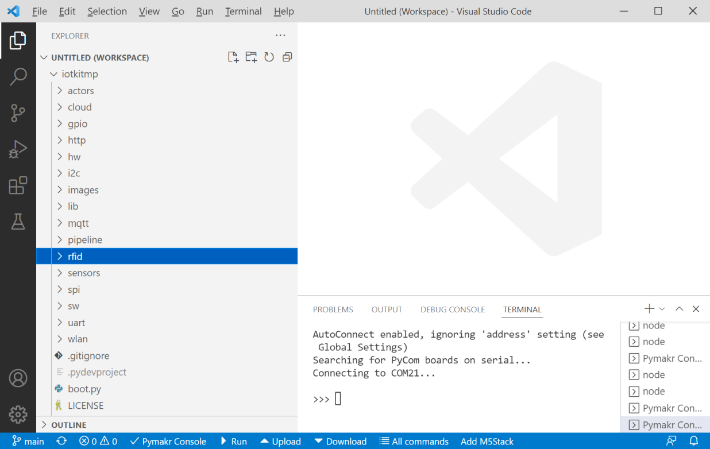

ESP32
-----

- - -

Das Board kann mittels [VSCode](https://code.visualstudio.com/) in [Micropython](https://micropython.org/) programmiert werden.

Dazu ist das Board via USB anzuschliessen und zuerst 
* Der Hardware [Treiber](https://docs.espressif.com/projects/esp-idf/en/latest/esp32/get-started/establish-serial-connection.html) zu installieren
* [Python](https://www.python.org/) und [esptool.py](https://docs.espressif.com/projects/esptool/en/latest/esp32/index.html)
* die Firmware downzuladen und [flashen](https://micropython.org/download/esp32/)

    esptool.py --chip esp32 --port <COM-Port> erase_flash
    esptool.py --chip esp32 --port <COM-Port> --baud 460800 write_flash -z 0x1000 esp32-idf3-20210202-v1.14.bin

Der **COM-Port** ist entsprechend anzupassen. Weil bei Versionen > 1.14 PWM nicht funktioniert, ist die Version 1.14 zu flashen.

Welcher **COM-Port** verwendet wird, kann in **Windows** mittels Geräte Manager (Explorer -> rechte Maustaste -> Dieser PC -> Verwalten) oder folgendem PowerShell Script, ermittelt werden:
    
    [System.IO.Ports.SerialPort]::getportnames()
    
Es ist der **COM-Port** vom Treiber Anbieter "Silicon Labs". 

Auf **MacOS** wird der **COM-Port** als `/dev/tty.usbmodem*` oder `/dev/tty.usbserial*` zur Verfügung gestellt.

Anschliessend werden noch folgende Produkte benötigt:
* [NodeJS](https://nodejs.org/) - wird von VS Extension Pymark benötigt
* [VSCode](https://code.visualstudio.com/) - die eigentliche Entwicklungsumgebung

Nach der Installation, VSCode starten und folgende Extension installieren
* [Pymakr](https://pycom.io/products/supported-networks/pymakr/) - diese stellt die Verbindung zum Board her.

Nach der Installation, sollte unten in der Statusleiste die Pymakr Console und weitere Befehle erscheinen.

Als erstes ist die Konfiguration mittels **All commands -> Pymakr Global Settings** oder **Ctrl + Shift + G** anzupassen.

Eine Konfiguration, welche die COM Schnittstelle des Board automatisch sucht, ist wie folgt:

    {
        "address": "",
        "username": "",
        "password": "",
        "sync_folder": "",
        "open_on_start": true,
        "safe_boot_on_upload": false,
        "py_ignore": [
            "pymakr.conf",
            ".vscode",
            ".gitignore",
            ".git",
            "project.pymakr",
            "env",
            "venv"
        ],
        "fast_upload": false,
        "sync_file_types": "py,txt,log,json,xml,html,js,css,mpy",
        "ctrl_c_on_connect": false,
        "sync_all_file_types": false,
        "auto_connect": true,
        "autoconnect_comport_manufacturers": [
            "Silicon Labs",
            "Silicon Laboratories",
            "wch.cn"
        ]
    }

Sollte das Board nicht gefunden werden ist:
* Hardware [Treiber](https://docs.espressif.com/projects/esp-idf/en/latest/esp32/get-started/establish-serial-connection.html) zu installieren
* Bei `address` der COM Port direkt anzugeben, z.B. `"address": "COM3",`.

Die wichtigsten Pymakr Befehle sind:
* **All commands -> Pymakr Global Settings** - Einstellungen anpassen
* **Pymakr Console** - öffnet die Consolen Ausgabe des Board (vorher Einstellungen anpassen, nicht vergessen)
* **Run** - führt den Python Code im aktuellen Fenster aus
* **Upload** - alle Dateien im geöffneten Verzeichnis auf das Board laden

Wenn alles funktioniert, ein neues leeres Verzeichnis `Open Folder` in VSCode öffnen, dass Repository [https://github.com/mc-b/iotkitmp.git](https://github.com/mc-b/iotkitmp.git) clonen und alle Dateien mittels **Upload** auf das Board laden.
